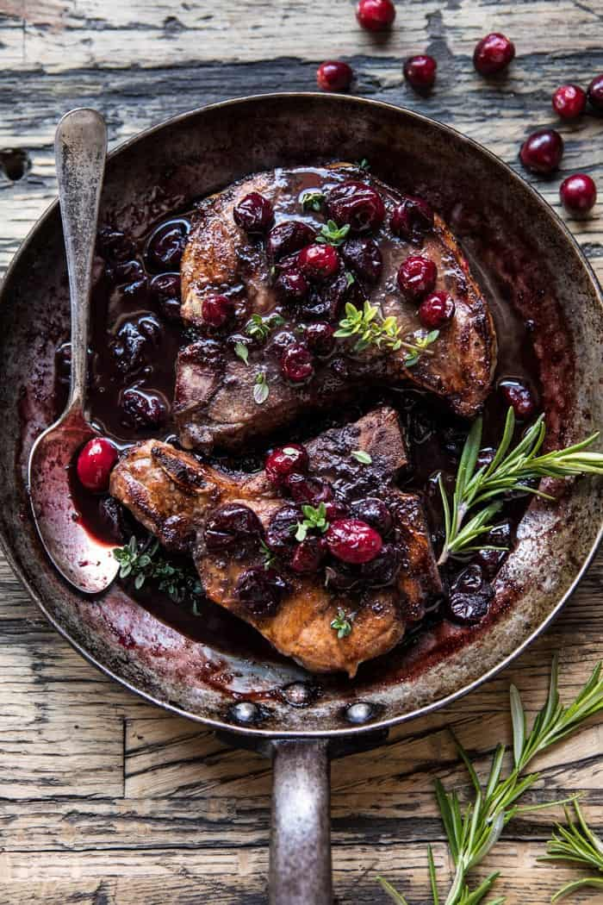

{width=100%}

**Prep Time:** 10 min | **Cook Time:** 20 min | **Total Time:** 30 min

## Ingredients

- 4 tablespoons brown sugar
- 1 teaspoon cayenne pepper
- 1/2 teaspoon cinnamon
- kosher salt and pepper
- 4  bone-in pork chops
- 2 tablespoons extra-virgin olive oil
- 3/4 cup red wine
- 1/2 cup pomegranate or cranberry juice
- 2 tablespoons butter
- 1 cup fresh cranberries
- 2  sprigs fresh thyme
- 1  sprig fresh rosemary

## Instructions

1. Preheat the oven to 450 degrees.
1. In a small bowl, stir together 3 tablespoons brown sugar, the cayenne, cinnamon, and a large pinch of both salt and pepper. Place the pork chops on a cutting board and rub them all over with the brown sugar mixture.
1. Heat the olive oil in a large skillet over high heat. When the oil shimmers, add the pork chops and sear for 2 to 4 minutes per side or until golden brown. Remove the pork chops from the skillet and set aside.
1. To the skillet, slowly pour in the wine and pomegranate juice. Add the remaining 1 tablespoon brown sugar, the butter, cranberries, thyme, and rosemary. Season with salt. Bring the sauce to a boil over high heat. Reduce the heat to medium and slide the pork chops into the sauce, cook for a minute longer and remove from heat.
1. Transfer the skillet to the oven and roast for 10-15 minutes or until the chops are lightly charred and the sauce thickened. Serve the chops with the pan sauce spooned over top.

