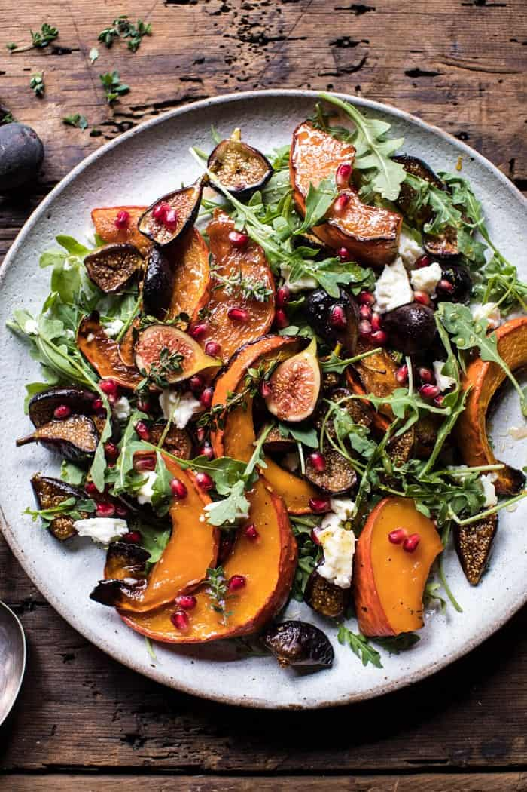

{width=100%}

**Prep Time:** 15 min | **Cook Time:** 30 min | **Total Time:** 45 min

## Ingredients

- 1  kabocha or acorn squash, sliced
- 1/4 cup + 2 tablespoons extra virgin olive oil
- 1/4 cup honey
- 2 tablespoons fresh thyme leaves
- kosher salt
- 16-20  fresh or dried figs, halved
- 2 tablespoons lemon juice
- 2 tablespoons apple cider vinegar
- 1 tablespoon orange zest
- black pepper
- 4 cups baby arugula
- 4 ounces feta cheese crumbles
- arils from 1 pomegranate

## Instructions

1. Preheat the oven to 425 degrees F.
1. On a rimmed baking sheet, toss together the squash, 2 tablespoons olive oil, honey, 1 1/2 tablespoons thyme leaves, and a good pinch of salt. Transfer to the oven and roast for 20 minutes. Remove from the oven, add the figs to the baking sheet and toss to combine. Return to the oven and roast another 10-15 minutes or until the figs have caramelized. If using dried figs, cook them only 5 minutes. This will soften them.
1. To make the dressing: In a mason jar, combine the remaining 1/4 cup olive oil, lemon juice, apple cider vinegar, remaining 1/2 tablespoon thyme, orange zest, and a pinch each of kosher salt and pepper.
1. Add the arugula to a large salad bowl and top with the roasted squash and figs. Crumble the feta overtop and sprinkle with pomegranate arils. Drizzle with the dressing. Enjoy!

