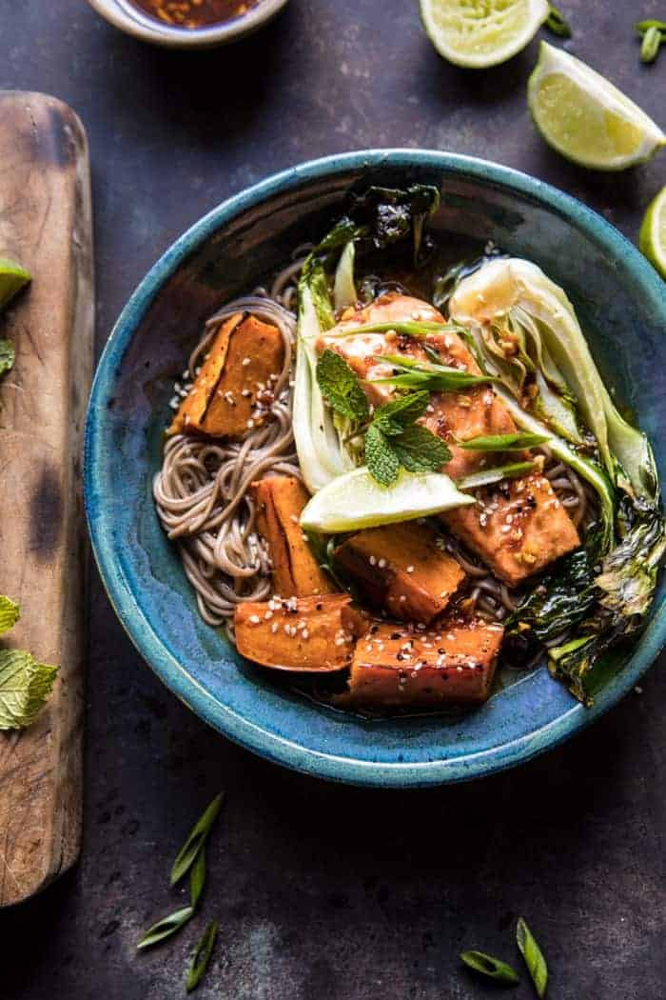

{width=100%}

**Prep Time:** 15 min | **Cook Time:** 30 min | **Total Time:** 45 min

## Ingredients

- 2 medium sweet potato, cut into wedges
- 2 tablespoons extra virgin olive oil
- kosher salt and pepper
- 3 tablespoons toasted sesame oil
- 1 inch fresh ginger, grated
- 1 clove garlic, minced or grated
- juice from 1 lime
- 3 tablespoons low sodium soy sauce or tamari
- 1 tablespoon honey
- 2 teaspoons chili paste
- 4  wild caught salmon fillets
- 4  baby bok choy, halved
- 12 ounces soba noodles
- 4 cups low sodium chicken or veggie broth
- 1/4 cup rice vinegar
- toasted sesame seeds, green onions, and basil for serving

## Instructions

1. Preheat oven to 425 degrees F.
1. On a large rimmed baking sheet, combine the sweet potatoes, olive oil, and a pinch each of salt and pepper. Toss well to evenly coat. Place in the oven and roast for 20 minutes.
1. To make the chili sauce. Combine the sesame oil, ginger, garlic, lime juice, 2 tablespoons soy sauce, honey, and chili paste in a glass jar. Shake to combine.
1. Remove the sweet potatoes from the oven. Arrange the salmon and bok choy around the potatoes. Spoon half of the chili sauce over the salmon. Transfer to the oven and roast for 10-15 minutes or until the salmon has reached your desired doneness. Spoon the remaining chili sauce over the veggies and salmon, gently tossing to combine.
1. Meanwhile, cook the soba noodles according to package directions. Drain. In a pot, bring the broth, rice vinegar, and remaining tablespoon of soy sauce to a boil over high heat. Keep warm.
1. To serve, divide the noodles, roasted veggies, and salmon among bowls. Ladle the broth over top. Garnish with sesame seeds and herbs. Enjoy!

