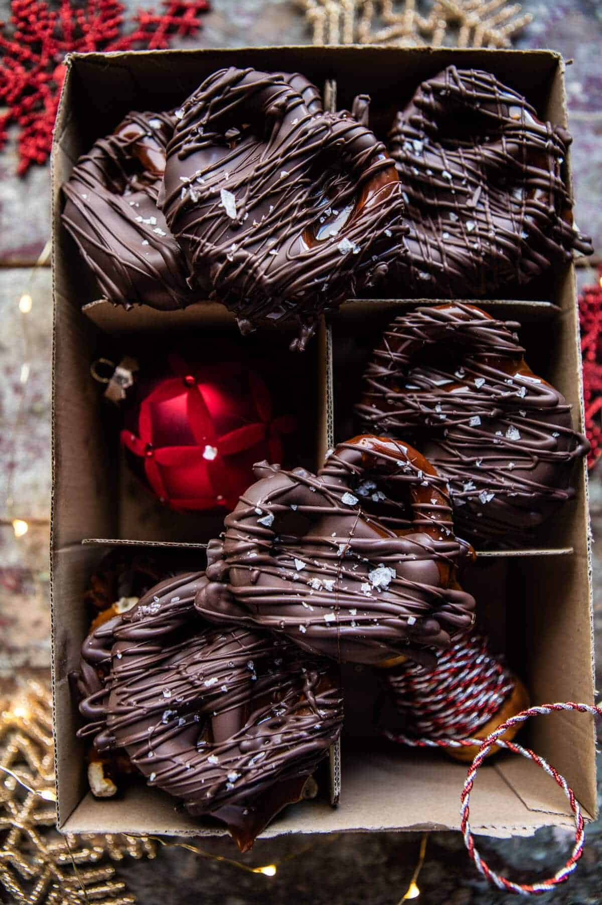

{width=100%}

**Prep Time:** 20 min | **Cook Time:**  | **Total Time:** 20 min

## Ingredients

- 1 (14 ounce) bag of caramels (unwrapped (or caramel bits))
- 1/4 cup heavy cream
- 2 teaspoons vanilla extract
- 1 (16 ounce) bag of pretzels (use your favorite size/shape)
- 12 ounces milk (semi-sweet or dark chocolate, melted)
- flaky sea salt (for topping)

## Instructions

1. Line 2 baking sheets with parchment paper.
1. Combine the caramels and cream in a saucepan over low heat. Melt stirring occasionally, until smooth, about 10 minutes. Remove from the heat and stir in the vanilla.
1. Dip each pretzel in the caramel and remove with a fork allowing any excess to drip off and back into the pan. Place each pretzel on the prepared baking sheet and let the caramel set, about 10 minutes.
1. Meanwhile, melt the chocolate in a microwave safe bowl on 30 second intervals, stirring after each until melted and smooth.
1. Dip each pretzel in chocolate and return to the parchment lined baking sheets. Repeat with the remaining pretzels. Sprinkle with flaky sea salt. Place the pretzels in the freezer to set for 10 minutes. Store in an air-tight container for up to 1 week.

