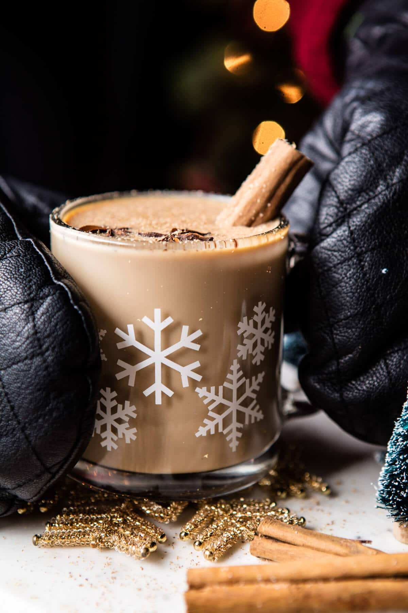

{width=100%}

**Prep Time:** 10 min | **Cook Time:** 20 min | **Total Time:** 30 min

## Ingredients

- 8  chai tea bags
- 4 cups whole milk
- 1/3 cup honey
- 2  cinnamon sticks
- 2 inch piece of fresh ginger
- 1 1/2 cups bourbon

## Instructions

1. Bring 6 cups of water to a boil in a large pot. Remove from the heat, add the tea bags, cover and let steep for 15-30 minutes. Remove the tea bags and stir in the milk, and honey. Place the pot over medium heat. Add the cinnamon sticks and ginger, cook stirring often until the mixture is steaming. Stir in the bourbon.
1. Ladle the drink into mugs. Dust with cinnamon if desired. Drink up!
1. Alternately, you can chill the cocktail and serve cold over ice.

