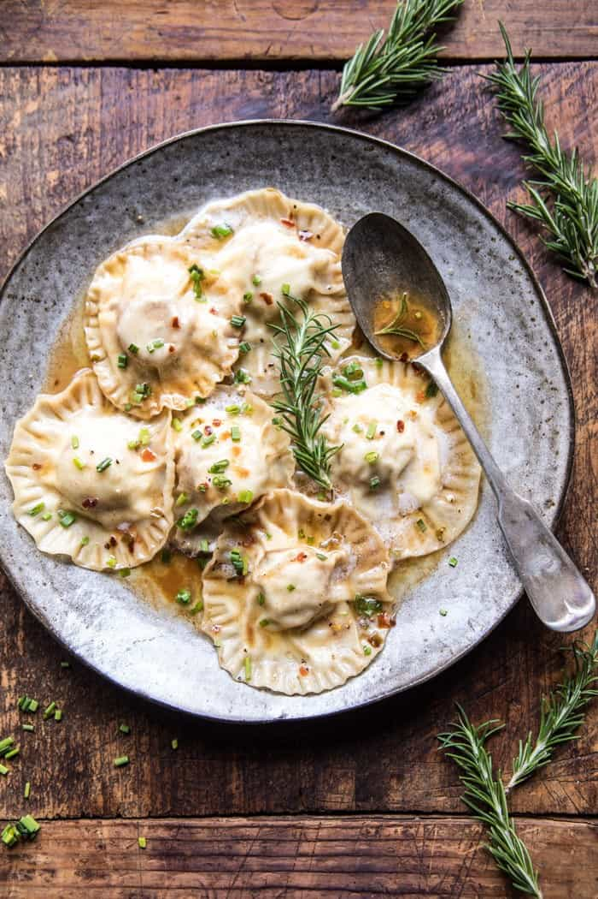

{width=100%}

**Prep Time:** 30 min | **Cook Time:** 20 min | **Total Time:** 50 min

## Ingredients

- 1 cup whole milk ricotta cheese
- 1/2 cup grated manchego cheese
- kosher salt and pepper
- 24  small wild caught scallops
- 2 tablespoons extra virgin olive oil
- 48  circle or square wonton wrappers
- 6 tablespoons salted butter
- 1 tablespoon chopped fresh rosemary plus more for serving
- 2 cloves garlic, minced or grated
- 1/4 cup white wine or chicken broth
- 1/4 cup fresh lemon juice
- pinch of crushed red pepper flakes
- kosher salt and pepper
- 1 tablespoon chopped fresh chives

## Instructions

1. In a medium bowl, stir together the ricotta and manchego. Season with salt and pepper.
1. Heat a large skillet over medium heat. Season the scallops with salt and pepper. Add the olive oil to the skillet and when the oil shimmers, add the scallops and sear on both sides until browned, about 2-3 minutes. Remove the scallops from the skillet to a plate. Let cool.
1. Lay out about 6 wrappers. Place 1 scallop on each wrapper and then spoon 1-2 teaspoons of ricotta over the scallop. Brush the edges with water. Lay a second wrapper on top of each ravioli. Press down the edges to seal, pressing out all the air. Crimp the edges with a fork. Be sure to keep the ravioli covered as you work to prevent them from drying out.
1. Return the skillet used to cook the scallops to medium high heat. Brown the butter, stirring often until the butter is golden and toasted. Add the rosemary and garlic and cook 30 seconds to a minute or until fragrant. Pour in the wine and lemon juice and bring to a boil. Add the chili flakes and season with salt and pepper. Cook 3-5 minutes. Remove from the heat and add the chives.
1. Meanwhile, bring a large pot of salted water to a boil. Boil the ravioli in batches for 1-2 minutes or until they float. Drain. Be gentle when working with the ravioli as they are delicate.
1. Divide the ravioli among bowls and ladle the sauce overtop. Top with chives. EAT!

