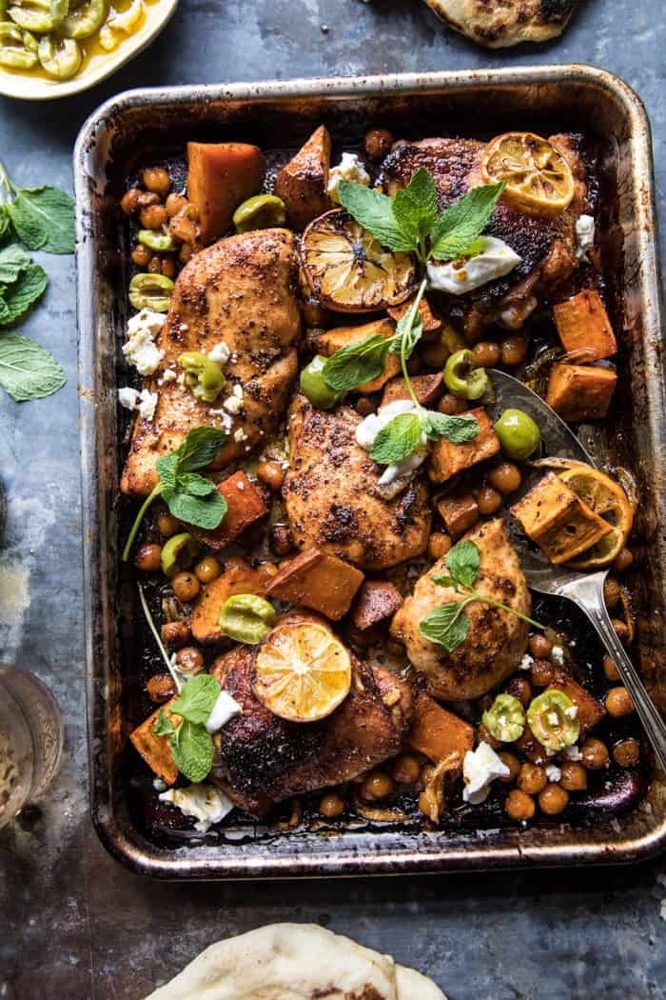

{width=100%}

**Prep Time:** 15 min | **Cook Time:** 40 min | **Total Time:** 55 min

## Ingredients

- 1 1/2 pounds boneless chicken breasts or thighs
- 1/4 cup olive oil plus, more for drizzling
- 2  lemons, juice and zest from 1 + 1 sliced
- 2 tablespoons Harissa seasoning
- 1 tablespoon honey
- kosher salt and black pepper
- 2 medium sweet potatoes, cut into 1 inch chunks
- 1  sweet onion, sliced
- 1 can (14 ounces) chickpeas, drained
- 1/2 cup crumbled feta
- 1/3 cup green olives, smashed
- plain greek yogurt and fresh mint or cilantro, for serving

## Instructions

1. Preheat the oven to 425 degrees F.
1. On a rimmed baking sheet, combine the chicken, 2 tablespoons olive oil, the lemon juice, lemon zest, harissa seasoning, honey, and a large pinch each of salt and pepper. Toss well to evenly coat the chicken. Add the sweet potatoes, onions, and chickpeas, and toss with the remaining 2 tablespoons olive oil, along with another pinch of salt and pepper. Arrange everything in an even layer. Add the lemon slices and then transfer to the oven. Roast for 40-45 minutes, tossing halfway through cooking until the chicken is cooked through and the potatoes are golden.
1. Meanwhile, combine the feta, olives, and a drizzle of olive oil in a bowl.
1. To serve, top the chicken with the feta, olives, and yogurt. Sprinkle with mint or cilantro. Enjoy!

