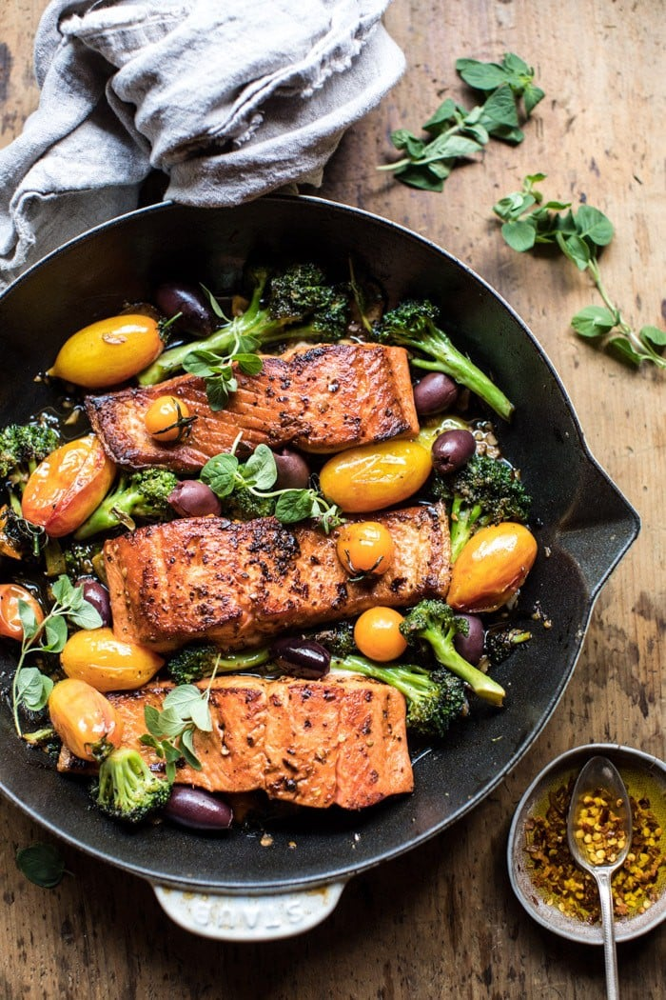

{width=100%}

**Prep Time:** 10 min | **Cook Time:** 15 min | **Total Time:** 25 min

## Ingredients

- 4  salmon fillets
- extra virgin olive oil, for rubbing
- juice from 1 lemon
- 1 teaspoon red pepper flakes
- 1 teaspoon paprika
- kosher salt and pepper
- 1 large head of broccoli, cut into florets
- 1 cup cherry tomatoes
- 2 cloves garlic, minced or grated
- 2 tablespoons chopped fresh oregano
- zest from 1 lemon
- splash of white wine
- 1/2 cup pitted kalamata olives

## Instructions

1. Heat a drizzle of olive oil in a large skillet over medium high heat.
1. Rub the salmon all over with olive oil and lemon juice. Sprinkle with chili flakes, paprika, salt, and pepper. Place flesh side down in the skillet and sear until crisp and just beginning to caramelize, about 2-3 minutes. Flip and cook 1 minute more or until your desired doneness is reached. Remove the salmon from the skillet.
1. Add another drizzle of oil to the pan, add the broccoli and cook until tender, about 5 minutes. Add the tomatoes, garlic, oregano, lemon zest, salt and pepper and cook until the tomatoes begin to burst, about 5 minutes. Remove from the heat and add a splash of wine to create a sauce. Add the olives and slide the salmon back into the skillet to warm throughout.
1. Serve the salmon with a side of veggies and any sauce left in the skillet. Garnish with fresh oregano.

