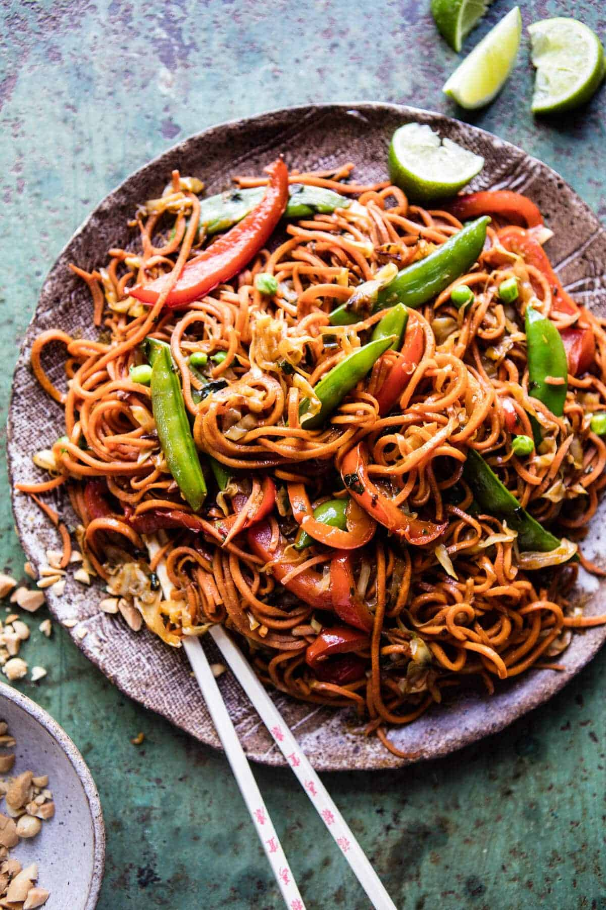

{width=100%}

**Prep Time:** 15 min | **Cook Time:** 15 min | **Total Time:** 30 min

## Ingredients

- 2  medium sweet potatoes
- 2 teaspoons sesame oil
- 1 tablespoon minced fresh ginger
- 1 clove garlic, minced or grated
- 1/4 cup tamari (or low sodium soy sauce)
- 1 tablespoon raw apple cider vinegar
- 1 tablespoon maple syrup (optional)
- 2-3 teaspoons curry powder
- 1 teaspoon coconut oil
- 1  red bell pepper, chopped
- 3 cups mung bean sprouts or shredded cabbage
- 6  green onions, thinly sliced
- 1 cup fresh or frozen peas
- fresh cilantro, for garnish

## Instructions

1. Using a spiralizer, turn the sweet potatoes into spaghetti-like noodles or use a vegetable peeler to create long, thin, ribbons, then set them aside. To prepare the sauce. in a small bowl, whisk together the sesame oil, ginger, garlic, tamari, vinegar, maple syrup, and 2 teaspoons of the curry powder, then set aside. In a large Dutch oven, melt the coconut oil over medium heat and cook the bell pepper until it starts to soften, about 5 minutes. Add the bean sprouts and reserved sauce and cook until the vegetables shrink in size, about 5 minutes more. Add the sweet potato noodles, green onions, and peas and toss well to combine. Partially cover the pot and cook until the potatoes are tender, 8 to 10 minutes.Taste and adjust the seasonings, adding more curry powder if desired. Serve warm, garnished with cilantro. Store leftovers in an airtight container in the refrigerator for up to 3 days.

