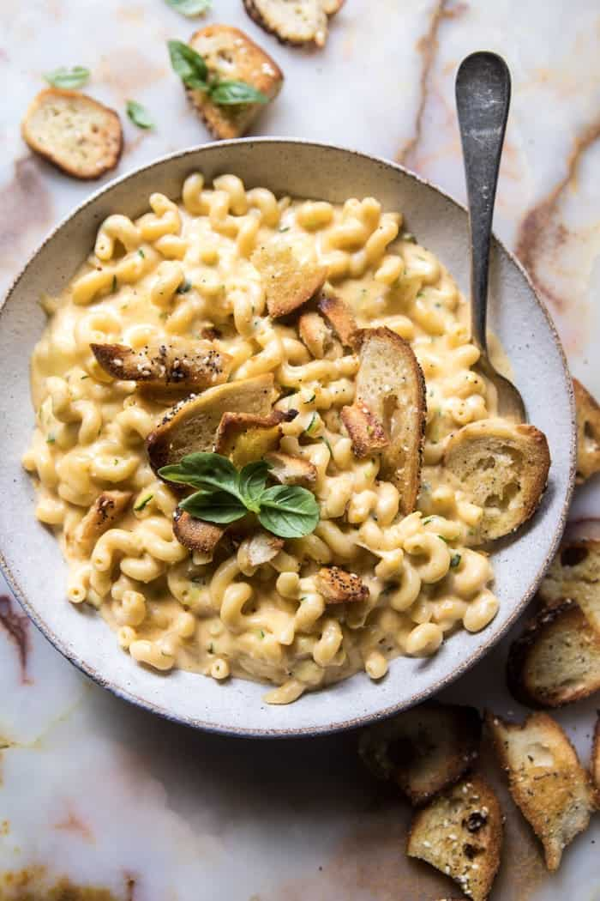

{width=100%}

**Prep Time:** 15 min | **Cook Time:** 25 min | **Total Time:** 40 min

## Ingredients

- 3 tablespoons olive oil
- 2  everything bagels thinly sliced
- 4 tablespoons butter
- 1/4 cup all-purpose flour
- 3 cups whole milk
- 1 pound short cut pasta
- 2  medium zucchini, grated
- 3 cups shredded sharp cheddar cheese
- 1 cup shredded Havarti cheese
- 1/4 teaspoon garlic powder
- 1/4 teaspoon cayenne pepper
- kosher salt + pepper

## Instructions

1. Preheat oven to 350 degrees F. Toss together the bagel pieces, olive oil, and a pinch of salt. Transfer to the oven and bake for 10-15 minutes, stirring halfway through cooking until the bagels are golden and crisp. Remove from the oven.
1. Meanwhile, melt the butter in a large pot over medium heat. Whisk in the flour. Reduce the heat to medium-low and let cook/bubble for 1 minute. Gradually whisk in the milk, 2 cups water and the pasta. Raise the heat up to medium-high and bring the mixture to a low boil, stir frequently until the pasta is al dente, about 15 minutes, adding in 1/4 cup more water as needed until the pasta is al dente. It is important to stir the sauce often to insure the pasta is being evenly cooked.
1. Once the pasta is al dente, stir in the zucchini, all of the cheeses, garlic powder, cayenne, salt and pepper. Stir until the cheese is fully melted and coats the pasta, about 5-10 minutes.
1. Divide the mac and cheese among bowls and top (generously) with crushed bagel chips. ENJOY!

