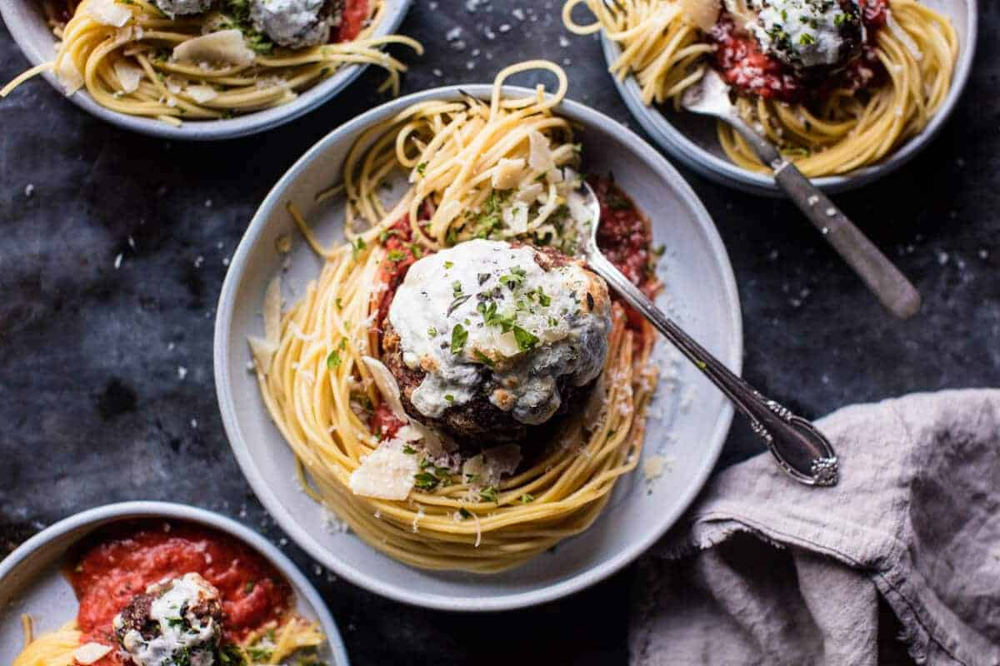

{width=100%}

**Prep Time:** 15 min | **Cook Time:** 30 min | **Total Time:** 45 min

## Ingredients

- 1 pound lean ground sirloin
- 3/4 cup bread crumbs
- 1/4 cup grated parmesan cheese
- 1/4 cup chopped parsley
- 1 teaspoon dried oregano
- pinch of crushed red pepper flakes
- kosher salt and pepper
- 2 tablespoons olive oil
- 1  egg
- 1  jar marinara sauce
- 1/3 cup mozzarella (shredded)
- whole wheat pasta or spaghetti squash (for serving)

## Instructions

1. Preheat the oven to 450 degrees F. Grease a 9x13 inch baking dish with olive oil.
1. Mix together the ground sirloin, bread crumbs, parmesan cheese, parsley, dried oregano, crushed red pepper, salt, pepper, olive oil and egg to a mixing bowl until just combined.
1. Coat your hands with a bit of olive oil, and roll the meat into 2 tablespoon size balls (will make 10-12 meatballs). Place the meatballs in the prepared baking dish and place in the oven. Bake for 15 minutes or until the meatballs are crisp on the outside, but not yet cooked through on the inside. Add the mozzarella cheese and continue cooking another 15-20 minutes or until the meatballs are cooked through.
1. To make a Giant meatball, form the meat mixture into and oval and place in the prepared baking dish. Transfer to the oven and bake for 35-45 minutes or until the meat is cooked through. During the last 10 minutes of cooking, add the cheese. Serve with pasta and marinara.

