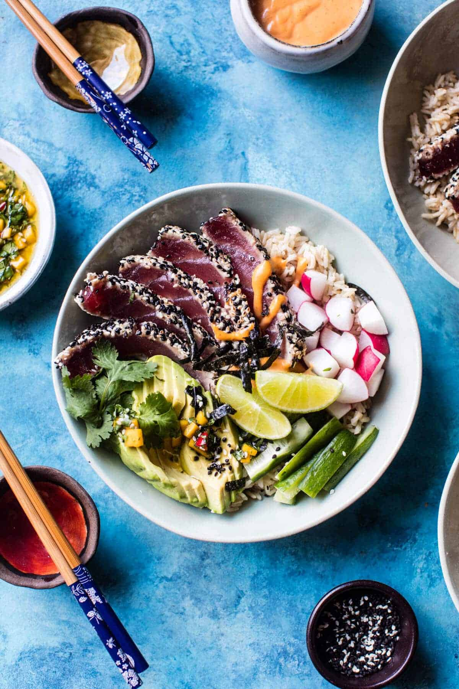

{width=100%}

**Prep Time:** 25 min | **Cook Time:** 5 min | **Total Time:** 30 min

## Ingredients

- 1  mango (diced)
- 1/2 cup fresh cilantro (chopped)
- 1  Fresno chile pepper (seeded + chopped)
- 1 clove garlic (minced or grated)
- 1/4 cup low sodium soy sauce (plus more for serving)
- 1/4 cup rice vinegar
- 1/4 cup toasted sesame oil
- juice of 1 lime
- 1/2 cup tahini
- 2 tablespoons sriracha
- 1 pound sushi grade tuna
- 1/4 cup black or white sesame seeds
- 2 teaspoons sesame oil
- 2-3 cups cooked brown rice
- 1  cucumber (cut into matchsticks)
- 4  radishes or daikon (sliced)
- 1  avocado (sliced)
- 4  thinly sliced or crumbled nori sheets

## Instructions

1. 

