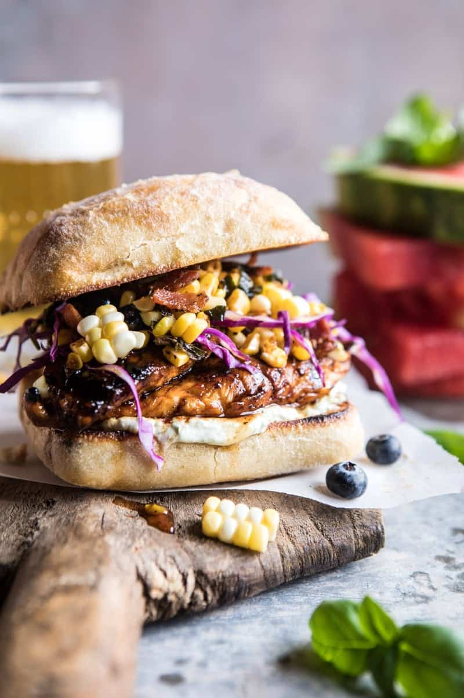

{width=100%}

**Prep Time:** 10 min | **Cook Time:** 20 min | **Total Time:** 30 min

## Ingredients

- 1/2 cup real maple syrup
- 1 tablespoon sambal oelek ((spicy chili sauce))
- 2 tablespoons extra virgin olive oil
- kosher salt and pepper
- 1 pound boneless skinless chicken tenders
- 4 slices thick cut bacon, chopped
- 4 ears corn, kernels removed from the cob ((about 4 cups total))
- 1 teaspoon smoked paprika
- 1/4 cup fresh basil, chopped
- 2  green onions, chopped
- 1/2 cup shredded cabbage
- 1/2 cup fresh blueberries
- 4  ciabatta rolls, toasted
- 1/2 cup plain greek yogurt
- 1/4 cup basil pesto
- 1  avocado, sliced

## Instructions

1. Stir together the maple syrup, sambal oelek, olive oil, and a pinch of salt in a small bowl. Add the chicken to a large ziplock bag and pour half the maple mixture over the chicken. Let sit for 10 minutes.
1. Meanwhile, heat a large skillet over medium heat and cook the bacon until crisp, about 5-8 minutes. Stir in the corn, paprika, and pinch each of salt and pepper. Cook 5 minutes and then add the basil, and green onions. Remove from the heat and let cool slightly. Stir in the cabbage and blueberries.
1. Preheat an outdoor grill or grill pan to medium heat. Oil the grates.
1. Add the chicken and grill for 5-8 minutes per side, basting the chicken with the reserve maple mixture until the chicken is cooked through. Remove from the grill and drizzle any remaining maple mix over the chicken.
1. Mix the yogurt and pesto together in a small bowl.
1. To assemble, spread the yogurt pesto mix onto the bottom of each bun. Top with chicken, corn, and avocado. EAT!

