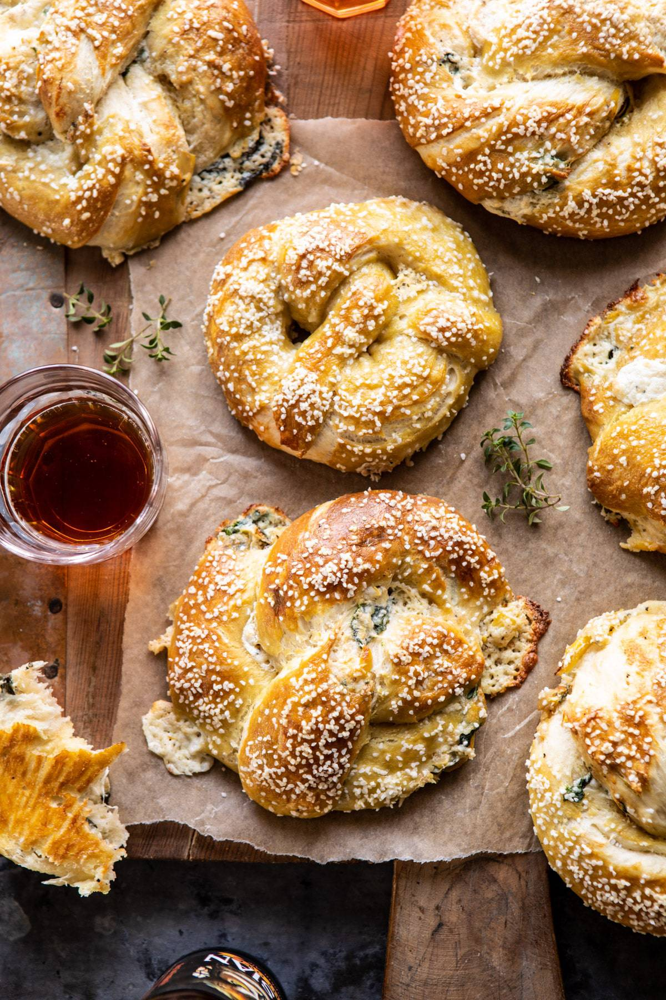

{width=100%}

**Prep Time:** 30 min | **Cook Time:** 25 min | **Total Time:** 55 min

## Ingredients

- 1/2 cup warm water
- 2 tablespoons light brown sugar
- 2 1/4 teaspoons active dry yeast
- 1 cup wheat beer, at room temperature
- 1 stick (1/2 cup)  salted butter
- 1 1/2 teaspoons sea salt or kosher salt
- 4 1/2 cups all-purpose flour
- 2/3 cups baking soda ((for boiling the pretzels))
- 1  egg, beaten
- Coarse sea salt
- 4 ounces cream cheese
- 1/2 cup shredded mozzarella cheese
- 1/2 cup grated parmesan cheese
- 1 clove garlic, minced or grated
- 1/2 teaspoon crushed red pepper flakes
- 1/2 cup frozen chopped spinach, thawed and squeezed dry of excess water
- 1 (6.7 ounce) jar marinated artichokes, chopped

## Instructions

1. Combine the water, brown sugar and yeast in the bowl of a stand mixer and mix with the dough hook until combined. Let sit for 5 minutes.
1. Add the beer, melted butter, salt, and flour to the mixture and mix on low-speed until combined. Increase the speed to medium and continue kneading until the dough is smooth and begins to pull away from the sides of the bowl, about 3 to 4 minutes. If the dough appears too wet, add additional flour, 1 tablespoon at a time. Remove the dough from the bowl, place on a flat surface and knead into a ball with your hands. Coat a large bowl with oil, add the dough and turn to coat with the oil. Cover with a clean towel or plastic wrap and place in a warm spot until the dough doubles in size. This will take about 1 hour.
1. Meanwhile, make the dip. In a medium bowl, combine the cream cheese, mozzarella, parmesan, garlic, and a pinch of crushed red pepper and salt. Stir in the spinach and artichokes.
1. Preheat the oven to 425 degrees F. Bring a large pot of water to a boil.
1. Divide the pretzel dough into 8 equal balls and roll each out into a rectangle (about 11x3 inches). Spread about 1 1/2 tablespoons spinach and artichoke dip along the length of each piece. Starting with the opposite side, roll the dough up into a log, enclosing the toppings inside. Pinch the seams together and then very gently roll the dough with your hands to form an even cylinder and fully enclose the filling (see above photos).
1. To shape into pretzels, take the right side and cross over to the left. Cross right to left again and flip up. Slowly add the baking soda to the boiling water. Boil the pretzels in the water, 2 at a time for 30 seconds, splashing the tops with the warmed water using a spoon. Remove with a large flat slotted spatula or a spider. Line two baking sheets with parchment paper placing 4 pretzels on each. Brush the tops with the beaten egg wash and season liberally with sea salt. Bake for 15 to 18 minutes or until pretzels are golden brown.
1. Remove pretzels from oven and let cool 5 minutes. Serve and enjoy! If needed, the pretzels can be reheated in a 350 degrees F. for 15 minutes.

