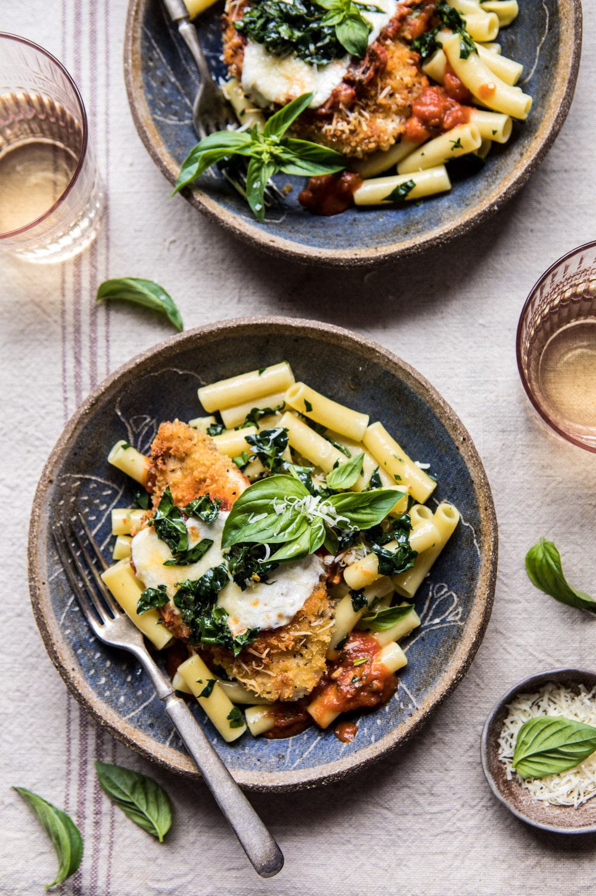

{width=100%}

**Prep Time:** 20 min | **Cook Time:** 20 min | **Total Time:** 40 min

## Ingredients

- 3  boneless, skinless chicken breasts, sliced in half horizontally
- 3 tablespoons extra virgin olive oil, plus more for the pan
- kosher salt and pepper
- 1 cup panko bread crumbs
- 1 cup grated parmesan cheese, plus more for serving
- 1 teaspoon dried oregano
- 1 jar (23 ounces) Bertolli® Rustic Cut Pasta Sauce
- 1 cup shredded mozzarella cheese
- fresh basil and arugula, for serving
- pasta, for serving
- 1 cup roughly chopped kale
- 1 cup fresh basil
- 2 tablespoons toasted pine nuts
- 1/3 cup grated parmesan cheese
- 1/4 cup olive oil
- 2 tablespoons lemon juice
- kosher salt

## Instructions

1. Preheat the oven to 400 degrees F.
1. Toss the chicken with olive oil and season with salt and pepper.
1. Add the bread crumbs, 1/2 cup parmesan cheese, and oregano to a shallow bowl. Working with 1 piece of chicken at a time, dredge through the bread crumbs. Repeat with the remaining chicken.
1. Heat a drizzle of olive oil in a large oven safe skillet over medium heat. When the oil simmers, add the chicken and cook for 1-2 minutes per side or until golden. Remove from the heat. Spoon a couple spoonfuls of pasta sauce over each piece of chicken and then top evenly with mozzarella and the remaining 1/2 cup parmesan.
1. Transfer the skillet to the oven and bake for 10 minutes or until the cheese is melted and the chicken is cooked through.
1. Serve the chicken over a bed of pasta with additional pasta sauce. Top each piece of chicken with kale pesto and fresh greens. Enjoy!

