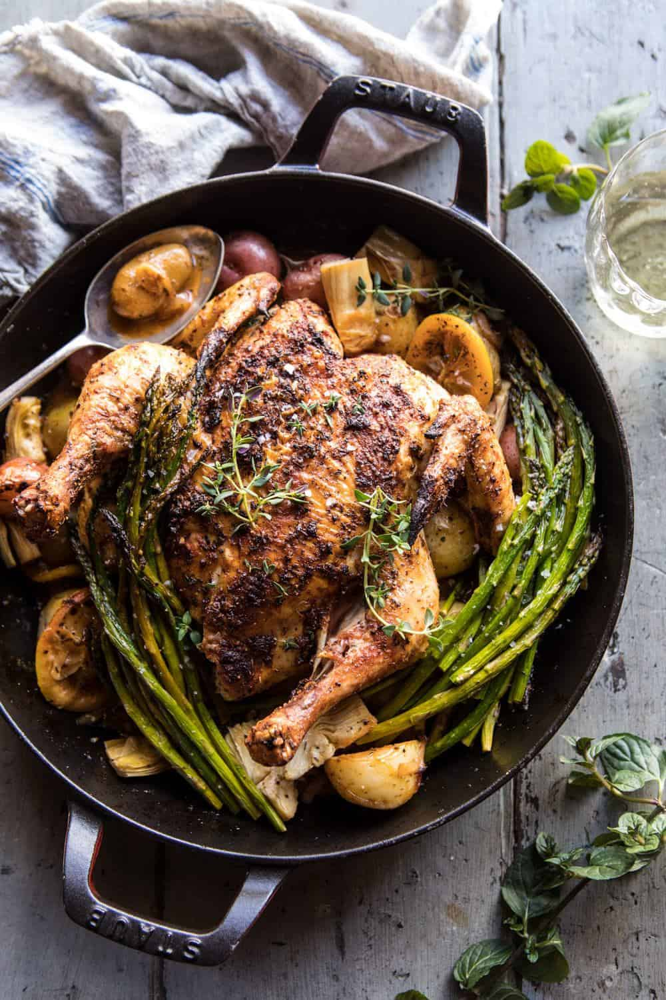

{width=100%}

**Prep Time:** 20 min | **Cook Time:** 40 min | **Total Time:** 1 hr

## Ingredients

- 1/4 cup extra virgin olive oil
- 1 tablespoon chopped fresh thyme
- 1 inch fresh ginger, grated
- 1 tablespoon smoked paprika
- 1-2 teaspoons cayenne pepper
- kosher salt and pepper
- 1 (3 1/2 to 4) pound whole chicken, backbone removed and butterflied*
- 2  lemons, 1 sliced and 1 for juicing
- 1  yellow onion, sliced
- 2 cloves garlic, smashed
- 1 pound mixed baby spring potatoes, halved if large
- 1/2 cup dry white wine
- 1  bunch asparagus ends trimmed
- 1/2 cup marinated artichokes

## Instructions

1. Preheat the oven to 450 degrees F.
1. In a small bowl, combine the olive oil, thyme, ginger, paprika, cayenne, and a large pinch each of salt and pepper.
1. In a large 12-inch skillet, layer the lemon slices, onions, garlic, and potatoes. Drizzle lightly with olive oil and season with salt and pepper. Place the chicken, skin side down, over the potatoes and brush with half of the herb  oil. Flip the chicken skin side up and coat in the remaining oil, being sure to cover the chicken completely.
1. Transfer to the oven and roast for 25-30 minutes. Pour the wine around the chicken. Add the asparagus and artichokes. Return the chicken to the oven and roast another 15-20 minutes or until the chicken is cooked through. Drizzle with lemon juice. Cut into pieces and serve. Enjoy!

