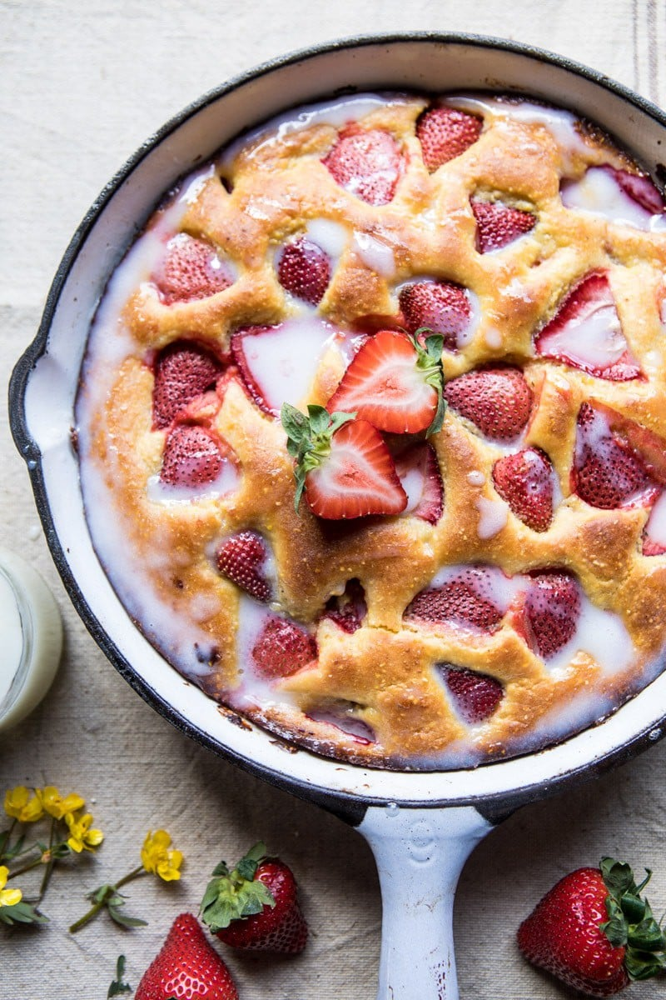

{width=100%}

**Prep Time:** 15 min | **Cook Time:** 30 min | **Total Time:** 45 min

## Ingredients

- 8 tablespoons unsalted butter, melted
- 2 tablespoons light brown sugar
- 1/2 cup honey
- 1/2 cup buttermilk
- 2 teaspoons lemon zest
- 2 teaspoons vanilla extract
- 2  eggs
- 1 1/2 cups Bobs Red Mill all-purpose flour
- 3/4 cup Bobs Red Mill Stone Ground Cornmeal
- 2 teaspoons baking powder
- 1/2 teaspoon kosher salt
- 2 cups fresh strawberries, halved
- 1/2 cup powdered sugar
- 2-4 tablespoons buttermilk

## Instructions

1. Preheat the oven to 350 degrees F. Grease one 10-12 inch cast iron skillet or cake pan.
1. In a large mixing bowl, beat together the butter, brown sugar, honey, buttermilk, lemon zest and vanilla until combined about 5 minutes. Add the eggs, one at time, beating after each until incorporated. Add the flour, cornmeal, baking powder, and salt and beat until combined. Fold in the strawberries.
1. Pour the batter into the prepared pan.
1. Bake for 25-30 minutes or until the cake is golden and a toothpick inserted into the center comes out clean. Be careful not to over bake.
1. To make the glaze, whisk the powdered sugar and buttermilk together until combined.
1. Drizzle the glaze over the cake. Slice and serve slightly warm. Enjoy!

