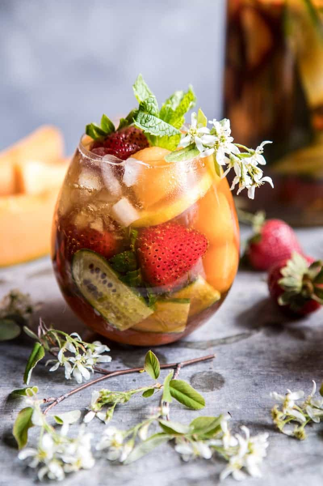

{width=100%}

**Prep Time:** 5 min | **Cook Time:**  | **Total Time:** 5 min

## Ingredients

- 4  cucumber slices
- 2  strawberries sliced
- 4  melon balls
- 2-3  lemons slices
- 3 ounces Pimms No 1
- 1 1/2 ounces Elderflower liquor ((St-Germain))
- 2 tablespoons lemon juice
- crushed ice
- ginger beer, for topping
- fresh thyme and mint, for serving

## Instructions

1. In the bottom of a tall glass, layer the cucumbers, strawberries, melon balls, and lemon slices, filling the glass about half way. Pour the Pimms, Elderflower liquor, and lemon juice over the cucumbers and fruit. Gently stir to combine. Add crushed ice and then top with ginger beer. Garnish with thyme and mint. Drink up!

