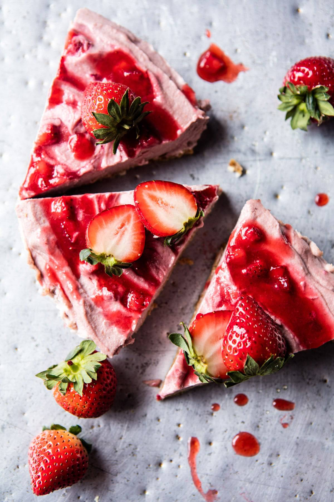

{width=100%}

**Prep Time:** 15 min | **Cook Time:** 10 min | **Total Time:** 25 min

## Ingredients

- 1/2 cup raw almonds
- 1/2 cup unsweetened coconut
- 1/4 cup old fashioned oats
- 1 cup packed dates, pitted
- pinch of flaky sea salt
- 4 1/2 cups roughly chopped strawberries
- 1/2 cup honey ((agave or maple if vegan))
- juice of 1 lemon
- 2 cups raw blanched almonds, soaked overnight in water
- 1 cup Almond Breeze Unsweetened Original Almondmilk
- 1/2 cup coconut oil
- 1 teaspoon vanilla extract
- fresh strawberries for serving

## Instructions

1. To make the crust. In the bowl of a food processor, combine the raw almonds, coconut, oats, dates, and pinch of salt. Pulse until finely chopped and easily holds together when squeezed in your hand. Press the base mixture into a 8-inch spring form pan. Place the pan in the freezer.
1. To make the filling. In a medium pot, bring the strawberries, honey, and lemon juice to a boil. Boil 8-10 minutes or until the mixture has thickened and becomes jam-like. Stir in a pinch of salt. Let cool and then puree in a blender.
1. Drain the almonds and add them to the bowl of your food processor with the Almondmilk, coconut oil, and vanilla. Pulse until smooth and creamy. Add 3/4 of the strawberry puree and pulse until combined. Remove the base layer from the freezer and add the almond cream in an even layer. Using a knife, swirl in the remaining strawberry puree. Cover and place in the freezer until firm, 1-2 hours. Remove 10 minutes before serving.

