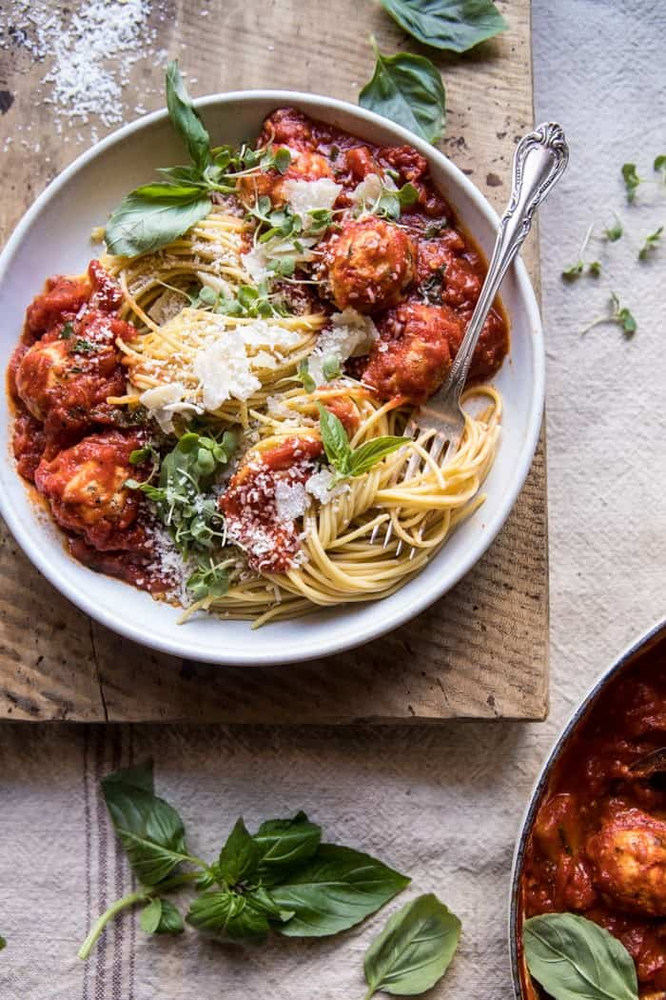

{width=100%}

**Prep Time:** 15 min | **Cook Time:** 30 min | **Total Time:** 45 min

## Ingredients

- 1 pound ground turkey or chicken
- 3/4 cup whole milk ricotta cheese
- 1/4 cup grated parmesan cheese, plus more for serving
- 1/4 cup marinated oil packed sun-dried tomatoes, oil drained and chopped
- 3 cloves garlic, minced or grated
- 1 cup fresh basil, chopped
- 1/4 cup fresh parsley, chopped
- 1/2 teaspoon crushed red pepper flakes
- kosher salt and black pepper
- 2 cans (28 ounces) San Marzano tomatoes
- 1/2 cup white wine
- 1 teaspoon dried oregano
- spaghetti, for serving

## Instructions

1. Preheat the oven to 450 degrees F. Line a baking sheet with parchment.
1. Add the turkey, ricotta, parmesan, sun-dried tomatoes, 1 clove garlic, 1/2 cup basil, the parsley, crushed red pepper flakes, and a pinch each of salt and pepper to a bowl. Coat your hands with a bit of olive oil, and roll the meat into 2 tablespoon size balls (will make 10-12 meatballs), placing them on the prepared baking sheet. Transfer to the oven and bake for 15 minutes or until the meatballs are crisp on the outside, but not yet cooked through on the inside.
1. To a large pot set over medium heat, add the tomatoes - crushing them by hand as you add them, the wine, remaining 2 cloves garlic, oregano, and a large pinch each of salt and pepper. Bring to a simmer over medium heat, stir in the meatballs and cook stirring occasionally, until the sauce thickens slightly and the meatballs are cooked through, about 25-30 minutes. Stir in the remaining 1/2 cup basil.
1. Divide the pasta among plates and spoon the meatballs and sauce over the pasta. Top with fresh basil.

