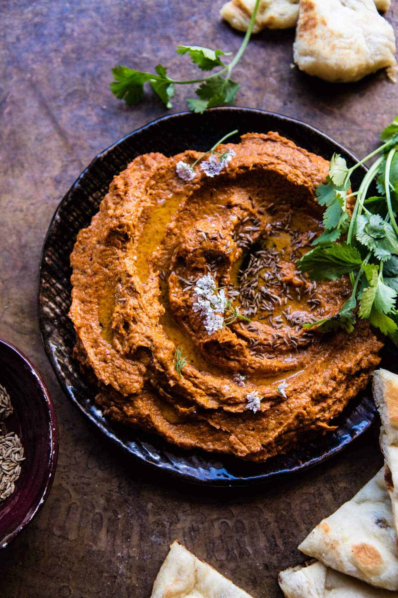

{width=100%}

**Prep Time:** 15 min | **Cook Time:**  | **Total Time:** 15 min

## Ingredients

- 2  roasted red peppers
- 1/3 cup sun-dried tomatoes, oil drained
- 1/4 cup olive oil (I use the oil from the sun-dried tomatoes)
- juice of 2 lemons
- 1 clove garlic, minced or grated
- 1/2 teaspoon cumin
- 1/2 teaspoon paprika
- 1 1/3 cups toasted walnuts, roughly chopped
- kosher salt and pepper
- 1 teaspoon cumin seeds
- flakey sea salt

## Instructions

1. In a food processor, combine the roasted red peppers, sun-dried tomatoes, olive oil, lemon juice, garlic, cumin, paprika, half the walnuts and a large pinch of both salt and pepper. Pulse until completely smooth and combined. Stir in the remaining walnuts. Heat a small skillet over medium heat and add the cumin seeds. cook stirring often until toasted, about 3-5 minutes. Spread the dip on a plate and drizzle with olive oil. Top with cumin seeds and salt.

