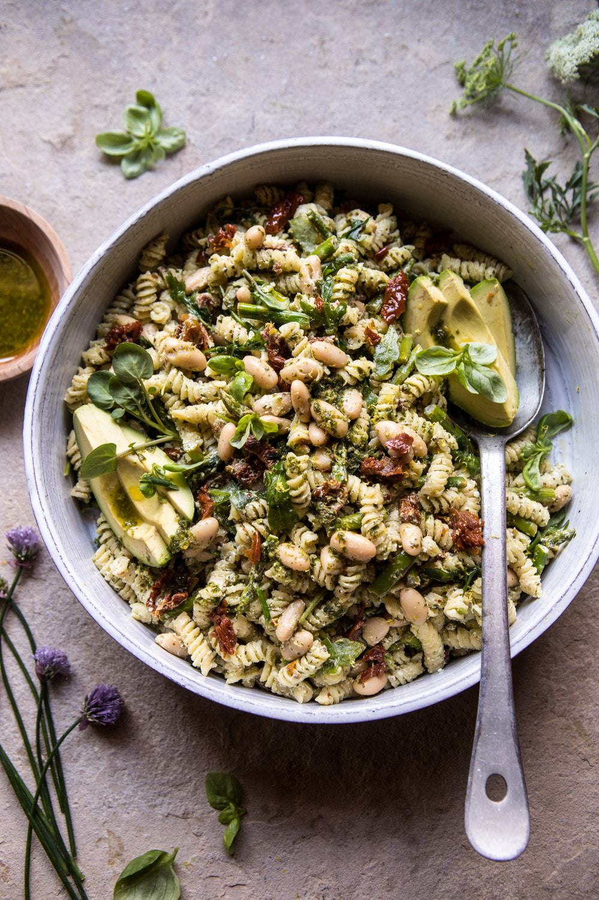

{width=100%}

**Prep Time:** 15 min | **Cook Time:** 10 min | **Total Time:** 25 min

## Ingredients

- 1/2 cup extra virgin olive oil
- 1 cup fresh basil
- 2  fresh chives
- 2 sprigs fresh dill
- 2 tablespoons lemon juice
- 1 tablespoon red wine vinegar
- 1 clove garlic, smashed
- 1/2 teaspoon crushed red pepper flakes, or more to taste
- kosher salt
- 1 pound short cut pasta
- 1  bunch asparagus, cut into 1 inch pieces
- 4-6 ounces soft goat cheese, crumbled
- 1 jar (8 ounces) oil packed sun-dried tomatoes chopped
- 1 can (14 ounces) white beans, drained
- 1  avocado, sliced

## Instructions

1. To make the vinaigrette. In a blender, combine the olive oil, basil, chives, dill, lemon juice, vinegar, garlic, 1 teaspoon of the salt, and a pinch red pepper flakes until smooth. Taste and adjust salt as needed.
1. Bring a large pot of salted water to a boil. Boil the pasta to al dente, according to package directions. During the last 2-3 minutes of cooking, add the asparagus to the water. Drain and add to a serving bowl.
1. Toss the hot pasta and asparagus with the goat cheese and a couple large spoonfuls of the basil vinaigrette, toss well until the goat cheese coats the pasta completely. Add the sun-dried tomatoes and white beans, tossing to combine. Top the pasta with avocado. Serve the remaining vinaigrette on the side.

