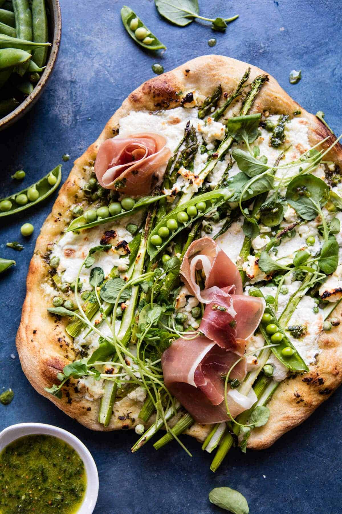

{width=100%}

**Prep Time:** 10 min | **Cook Time:** 10 min | **Total Time:** 20 min

## Ingredients

- 1/3 cup olive oil
- juice + zest of 2 lemons
- 1/4 cup fresh basil
- 1 tablespoon dijon mustard
- 1 teaspoon kosher salt and pepper
- 1/2 pound homemade or store-bought pizza dough
- 1/2 cup crumbled feta cheese
- 1  small bunch asparagus, cut in half lengthwise
- 1 cup fresh sugar snap peas or frozen peas
- 8 ounces burrata cheese
- 6 ounces thinly sliced prosciutto
- 1  handful of sprouts or watercress
- 1 tablespoon chopped fresh chives
- crushed red pepper flakes, for sprinkling

## Instructions

1. 

