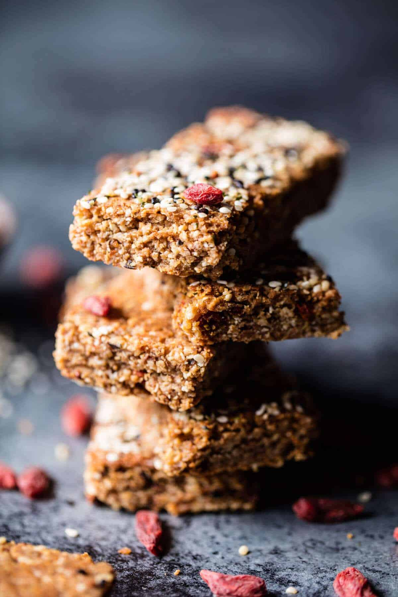

{width=100%}

**Prep Time:** 15 min | **Cook Time:** 40 min | **Total Time:** 55 min

## Ingredients

- 1 1/2 cups raw cashews
- 1/2 cup raw almonds
- 1 cup raw (unsweetened coconut flakes)
- 1/4 cup + 1 tablespoon sesame seeds
- 4 tablespoons hemp seeds
- 1/4 cup cooked quinoa
- 1/4 cup tahini
- 1 teaspoon kosher salt
- 1/4 teaspoon cinnamon
- 1/2 cup organic honey
- 1 tablespoon coconut oil
- 1 teaspoon vanilla extract
- 1/2 cup dried goji berries

## Instructions

1. Preheat oven to 350 degrees F. Coat an 8x8 inch baking pan with cooking spray and then line with parchment paper. Set aside.
1. Toast the cashews, almonds, coconut, 1/4 cup sesame seeds, and 3 tablespoons hemp on a baking sheet, stirring occasionally, until golden brown, about 8–12 minutes. Let cool slightly.
1. Add the toasted nuts and seeds, plus the quinoa, tahini, cinnamon, and salt to a food processor or high powdered blender. Process until finely chopped.
1. Bring the honey and the coconut oil to a boil in a small saucepan. Cook, stirring, for about 1 minute. Remove and stir in the vanilla. Pour over the cashew/seed mixture and stir to coat. Stir in the goji berries.
1. Press the mixture firmly into the prepared 8x8 pan with the back of a greased measuring cup or wet hands. Top the bars with the remaining 1 tablespoon sesame and hemp seeds. Press the seeds gently to adhere.
1. Transfer to the oven and bake until golden brown, 25–30 minutes. Let cool, then cut into the bars. Store in an airtight container at room temp or in the fridge.

