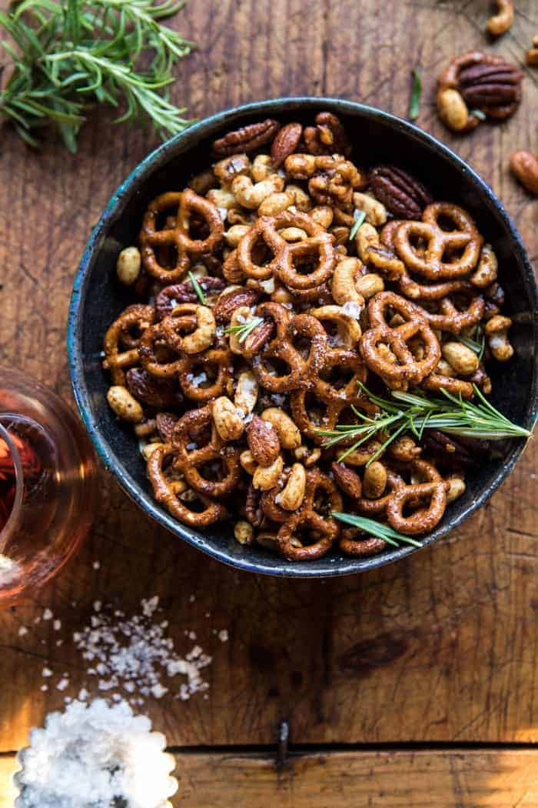

{width=100%}

**Prep Time:** 10 min | **Cook Time:** 35 min | **Total Time:** 45 min

## Ingredients

- 4 cups mixed raw nuts
- 2 cups pretzel twist
- 2 tablespoons salted butter, melted
- 2 tablespoons low sodium soy sauce or tamari
- 1/4 cup real maple syrup
- 1 tablespoon chopped fresh rosemary, plus more for serving
- 1 1/2 -2 teaspoons cayenne pepper
- 1 1/2 teaspoons chili powder
- 1/2 teaspoon smoked paprika
- 1/2 teaspoon each onion and garlic powder
- 1 teaspoon kosher salt

## Instructions

1. Preheat the oven to 350 degrees F.
1. On a parchment lined baking sheet, combine the nuts and spread in a single layer. Transfer to the oven and roast for 15-20 minutes or until lightly golden and toast. Remove from the oven and add the pretzels, butter, soy sauce, maple, rosemary, cayenne, chili powder, paprika, onion powder, garlic powder, and salt. Toss well to evenly combine. Return to the oven and roast for another 10-15 minutes or until the nuts are glazed.
1. Serve warm with additional rosemary or cool completely and store in an air tight container for up to 2 weeks.

