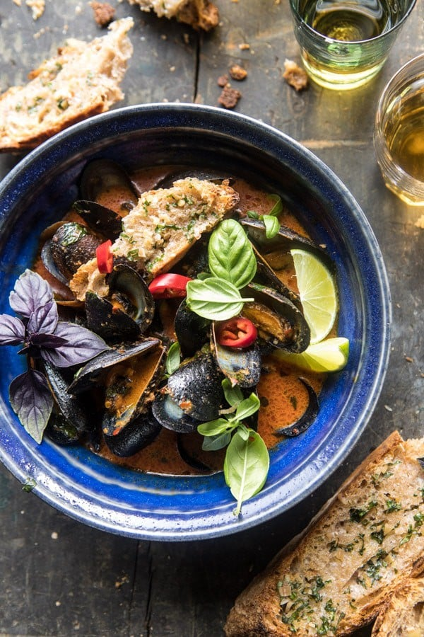

{width=100%}

**Prep Time:** 10 min | **Cook Time:** 15 min | **Total Time:** 25 min

## Ingredients

- 2 1/2 pounds black mussels, beards removed and scrubbed clean
- 4 tablespoons Land O Lakes® Salted Butter
- 1/4 cup Thai red curry paste
- 1 14 ounce can full-fat coconut milk
- 1/2 cup white wine
- kosher salt and pepper
- 1/4 cup fresh basil, roughly torn, plus more for serving
- fresh limes and chiles, for serving
- 4 tablespoons Land O Lakes® Salted Butter
- 1 tablespoon finely chopped lemongrass
- 2 cloves garlic, minced or grated
- 1/4 cup fresh basil, chopped
- 1  sourdough baguette sliced

## Instructions

1. In a large skillet, melt the butter over medium heat. Add the curry paste and cook for 1 minute. Stir in the coconut milk, wine, and a pinch each of salt and pepper. Bring the mixture to a simmer and add the mussels. Cover and cook for 4-5 minutes, shaking the pan occasionally until the mussels have all opened. Discard any mussels that don’t open. Stir in the basil.
1. Meanwhile, make the toast. Preheat the oven to 425 degrees F.
1. In a small bowl, combine the butter, lemongrass, garlic, basil, and a pinch of salt. Spread the butter over each piece of bread and place on a baking sheet. Transfer to the oven and cook for 8-10 minutes or until the bread is toasted.
1. Serve the mussels warm with basil, limes and chiles. Serve the toast on the side for dipping. Enjoy!

