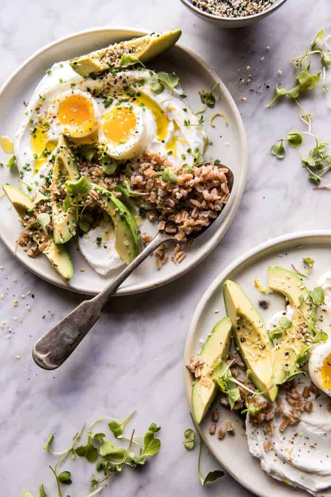

{width=100%}

**Prep Time:** 10 min | **Cook Time:** 10 min | **Total Time:** 20 min

## Ingredients

- 1 cup plain full fat greek yogurt
- 1 cup cooked brown rice, farro, or quinoa
- 2  eggs, soft-boiled, poached, or fried
- 1  avocado, sliced
- juice from 1 lemon
- 2 tablespoons everything bagel spice, homemade or store-bought
- 1 cup arugula or micro greens
- flaky sea salt
- extra virgin olive oil
- fresh chopped chives, basil, or dill, for serving

## Instructions

1. Spread the yogurt between 2 bowls. Top with brown rice, eggs, and avocado. Drizzle with lemon juice. Sprinkle with everything spice. Add a handful of greens. Drizzle each bowl lightly with olive oil and sprinkle with fresh herbs. Enjoy!

