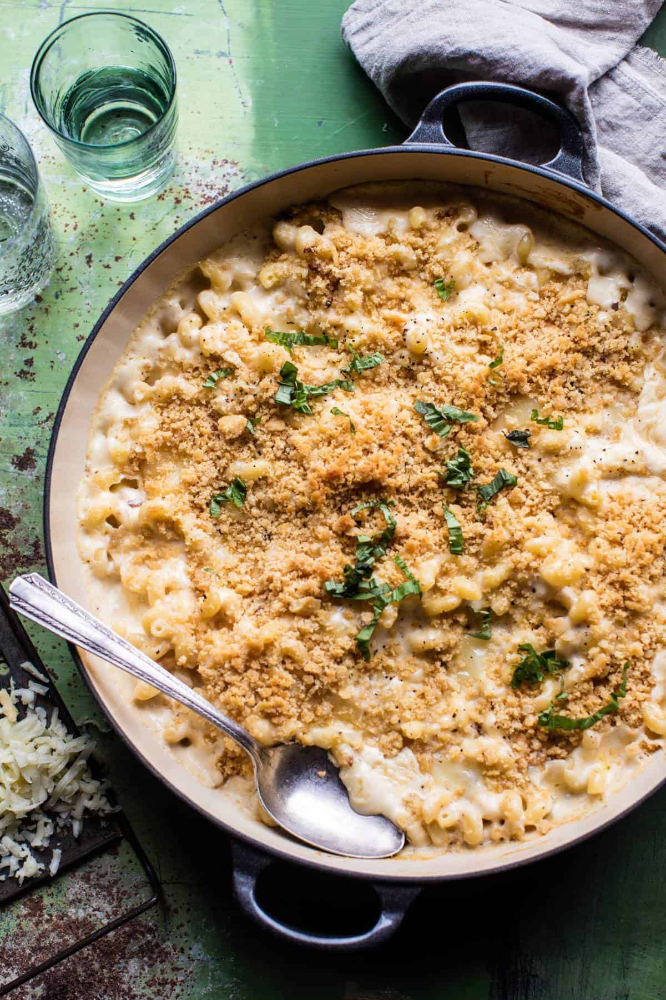

{width=100%}

**Prep Time:** 15 min | **Cook Time:** 45 min | **Total Time:** 1 hr

## Ingredients

- 7 tablespoons unsalted butter
- ¼ cup all-purpose flour
- 3 cups 2% or whole milk
- 1 pound elbow macaroni
- 1  garlic clove, minced or grated
- 1½ cups crushed Ritz Crackers  ((about 1 sleeve))
- 4 ounces cream cheese, cut into cubes
- 1¼ cups shredded sharp white cheddar cheese
- 1¼ cups shredded fontina cheese
- 1 cup shredded Havarti cheese
- 1 cup shredded smoked Gouda cheese
- ¼ teaspoon cayenne
- Kosher salt and freshly ground pepper
- Fresh basil leaves, for topping

## Instructions

1. Preheat the oven to 350°F. Spray a 9 x 13-inch baking dish with cooking spray.
1. In a large saucepan, melt 4 tablespoons of the butter over medium heat. Whisk in the flour. Reduce the heat to medium-low and cook for 1 minute, stirring once to avoid burning—it will bubble. Gradually whisk in the milk and 2 cups of water, then stir in the macaroni. Increase the heat to medium-high and bring the mixture to a boil. Stir frequently until the macaroni is just al dente, 8 to 10 minutes.
1. Meanwhile, in a medium skillet, melt the remaining 3 tablespoons of butter over medium-low heat. Add the garlic and cook for 30 seconds, or until fragrant. Add the crushed crackers and toss to coat. Toast the crumbs until browned, stirring frequently to avoid burning, for 3 to 5 minutes. Remove the pan from the heat and set aside.
1. When the macaroni is al dente, remove the pan from the heat and stir in the cream cheese, cheddar, fontina, Havarti, Gouda, and cayenne and season with salt and pepper. Stir until the cheeses have fully melted. Transfer the mixture to the prepared baking dish.
1. Evenly sprinkle the toasted cracker crumbs over the mac and cheese and place the baking dish on a baking sheet. Bake for 15 to 20 minutes, or until the crumbs are golden brown and the sauce is bubbling. Remove from the oven and let sit for 5 minutes (yeah, right). Garnish with fresh basil. Dig in!

