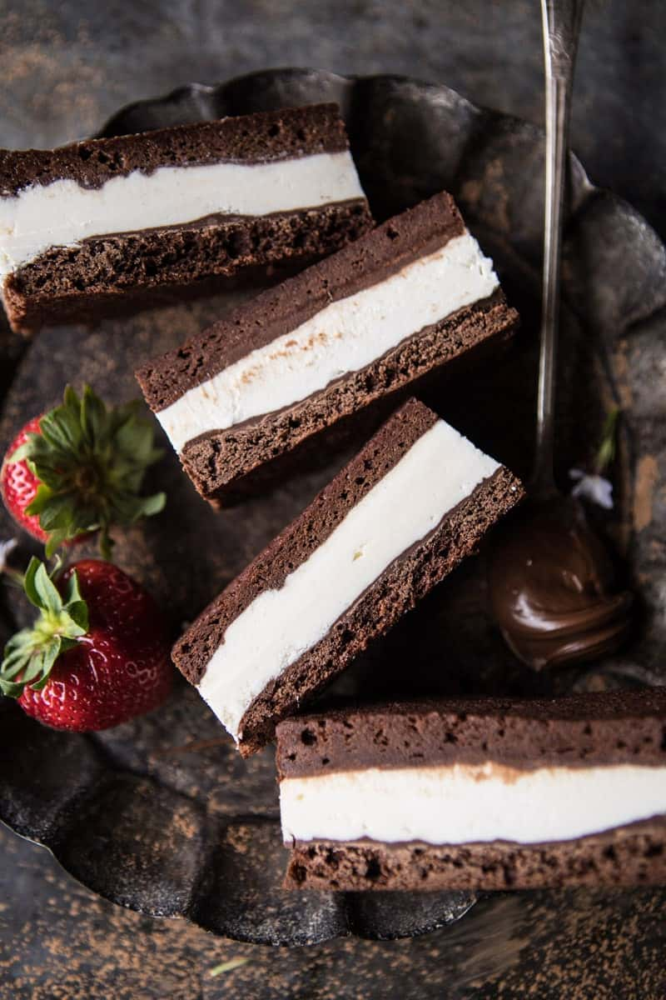

{width=100%}

**Prep Time:** 20 min | **Cook Time:** 10 min | **Total Time:** 6 hr

## Ingredients

- 1 stick (1/2 cup) unsalted butter
- 2 ounces chocolate, milk or dark, chopped
- 3/4 cup granulated sugar
- 2 teaspoons vanilla extract
- 1-2 tablespoons instant coffee granules
- 2  large eggs
- 1/2 cup unsweetened cocoa powder
- 1/2 cup all-purpose flour
- 1/4 teaspoon kosher salt
- 1/2 cup Nutella
- 4 ounces mascarpone cheese
- 1/2 cup sweetened condensed milk
- 1 cup heavy cream
- 1 teaspoon vanilla
- pinch of flaky sea salt

## Instructions

1. Preheat the oven to 350 degrees F. Line two (8x8 inch) square baking pans with parchment paper.
1. Add the butter and chocolate to a medium size, microwave safe, mixing bowl. Microwave on high for 30 second intervals, stirring after each interval, until melted and smooth. To the melted chocolate whisk in the sugar, vanilla,  coffee, and eggs until smooth. Stir in the cocoa powder, flour and salt until just combined, try not to over mix the batter. It will be thick. Divide the batter evenly into the prepared pans, spreading it in an even layer, the layers will be thin. Transfer to the oven and bake for 10-12 minutes, until the brownies are set on top. Remove from the oven and allow to cool completely.
1. Once cooled, spread the Nutella evenly onto each brownie pan.
1. To make the ice cream. Add the mascarpone and sweetened condensed milk to the bowl of a stand mixer fitted with the whisk attachment (or use a hand held electric mixer) and whip until smooth and combined. Add the heavy cream, vanilla and salt. Whip until stiff peaks form.
1. Spread the ice cream in an even layer over top one of the brownie pans. It's easiest if you keep the brownie in the parchment lined square baking pan. Then place the other brownie gently on top of the ice cream, Nutella side facing down. Cover with plastic wrap and freeze for 4-6 hours or overnight.
1. Slice bars into rectangles and keep stored in the freezer for up to a couple months.

