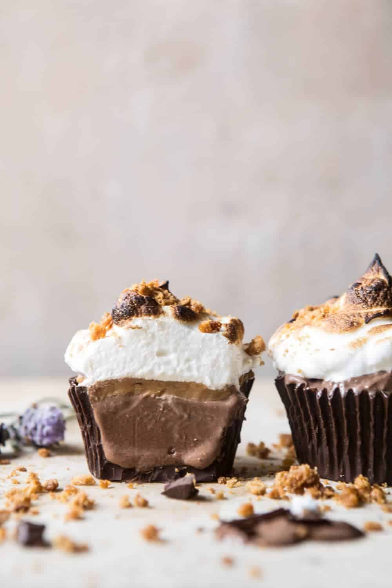

{width=100%}

**Prep Time:** 30 min | **Cook Time:** 5 min | **Total Time:** 35 min

## Ingredients

- 1  sleeve of graham crackers, crushed
- 6 tablespoons salted butter, softened
- 1 tablespoon honey
- 12 ounces semi-sweet chocolate, melted
- 6 cups chocolate ice cream
- 1/2 cup creamy peanut butter  ((optional))
- 4  large egg whites
- 1 cup granulated or caster (powdered) sugar
- 1/2 teaspoon vanilla extract

## Instructions

1. Preheat an oven to 325 degrees F. Line a baking sheet with parchment paper.
1. To make the graham cracker crumble. Combine the graham crackers, butter, and honey in a medium bowl. Transfer to the prepared baking sheet and bake until light golden brown, about 10 minutes.
1. Place 12 cupcake liners in a cupcake mold. Using the back of a spoon, smooth the melted chocolate up the sides of the liners. Sprinkle a little of the graham cracker crumble into the bottom of each cup (reserve the rest for serving). Place in the freezer for 10-15 minutes or until firm. Fill each cup with chocolate ice cream and a layer of peanut butter, if using. Freeze until firm, about 1-2 hours or overnight.
1. Just before serving, make the marshmallow. Bring a large pot of water to simmer. Whisk the egg whites and sugar together in the bowl of a stand mixer. Place the bowl of the stand mixer over the pot of simmering water and cook, stirring often, until the egg whites are very warm to the touch and the sugar has dissolved, remove the bowl from the heat. Whip the egg whites on high until stiff peaks form. Add the vanilla and whip to combine.
1. Top the frozen cups with marshmallow. Using a blow torch, toast the marshmallow. Serve immediately.

