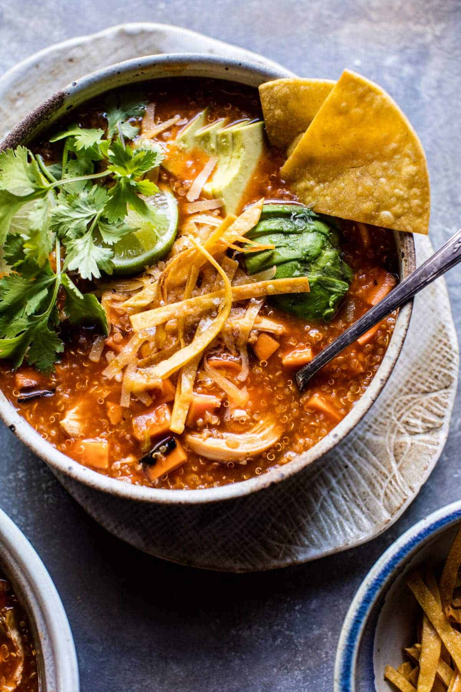

{width=100%}

**Prep Time:** 10 min | **Cook Time:** 20 min | **Total Time:** 30 min

## Ingredients

- 2 tablespoons olive oil
- 1  small sweet onion
- 1  sweet potato (chopped (peel if you’d like))
- 3 cups low sodium chicken broth (plus more if needed)
- 3 ounce cans Old El Paso Enchilada Sauce (10)
- 1 ounce can Old El Paso Chopped Green Chiles (4)
- ½ cup dry quinoa
- 1-2 cups shredded turkey (may also use shredded chicken)
- 1 ounce can black beans (drained and rinsed, 14)
- 1-2 cups shredded cheddar cheese
- diced avocado (cilantro, and tortilla crisp/chips, for serving)

## Instructions

1. Heat the oil in a large stockpot over medium-high heat. When the oil shimmers, add the onion and sweet potatoes. Season with salt and pepper and cook for 5-8 minutes or until softened and the onion fragrant. Slowly pour in the chicken broth, enchilada sauce, green chiles, and 1 cup water. Bring the mix to a boil over high heat. Add the quinoa, cover and reduce the heat to low. Cook for 15 minutes or until the quinoa is soft. Stir in the turkey, black beans, and 1 cup cheddar cheese. Cook until the cheese is melted and the turkey warm, about 5 minutes. Remove from the heat.
1. Ladle the soup into bowls, garnish with avocado, cheddar cheese, cilantro and chips. Eat!

