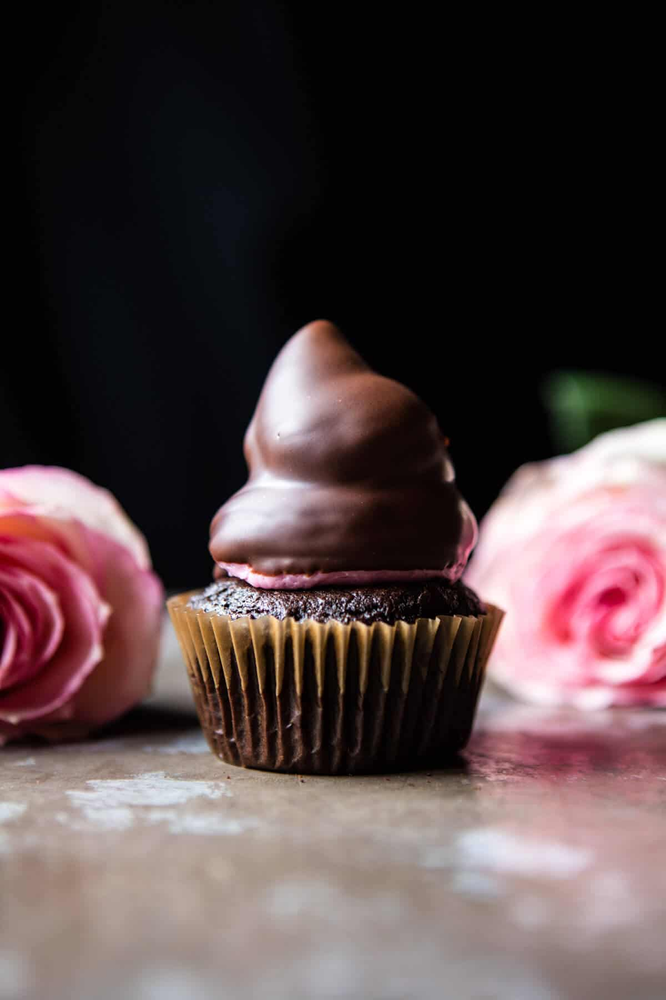

{width=100%}

**Prep Time:** 30 min | **Cook Time:** 30 min | **Total Time:** 1 hr

## Ingredients

- 1 1/2 cups all-purpose flour
- 1 1/2 cups granulated sugar
- 1 cup unsweetened cocoa powder
- 1 1/2 teaspoons baking soda
- 1 1/2 teaspoons baking powder
- 1 teaspoon salt
- 2  eggs (at room temperature*)
- 1 cup buttermilk
- 1/2 cup canola oil
- 1 tablespoon vanilla extract
- 1/2 cup hot brewed coffee (or water)
- 1/2 cup Nutella
- 3  eggs whites
- 3/4 cup granulated sugar
- 1 1/2 sticks (3/4 cup) unsalted butter (softened)
- 1 teaspoon vanilla extract
- 1-2 teaspoons beet juice or 1-2 drops red food coloring
- 2 cups semi-sweet chocolate chips
- 3 tablespoons coconut oil or canola oil

## Instructions

1. Preheat the oven to 350 degrees F. Line 2 cupcake tins with paper liners.
1. In a medium bowl combine the flour, sugar, unsweetened cocoa powder, baking soda, baking powder and salt.
1. In the bowl of a stand mixer (or use a hand held mixer) beat together the eggs, buttermilk, canola oil and vanilla until smooth. Slowly add the dry ingredients to the wet ingredients with the mixer on low until there are no longer any clumps of flour. Add the coffee and mix until combined. Batter should be pourable, but not super thin.
1. Pour the batter among 18-20 cupcake liners. Transfer to the oven and bake for 12-15 minutes, until the tops are just set and no longer wiggly in the center. Remove and let cool completely before filling and frosting.
1. Use a small paring knife to cut a cone-shaped piece from the center of each cooled cupcake. Fill the hole with nutella, then replace the top portion of the cone (you'll need to slice off the tip).
1. To make the buttercream. Bring a large pot (big enough to place your mixing bowl over top) of water to boil. In the bowl of a stand mixer whisk the egg whites and sugar together. Place the bowl of the stand mixer over the pot of boiling water and cook, stirring often, until the egg whites are very warm to the touch and the sugar has dissolved, remove the bowl from the heat. Whip the egg whites on high until stiff peaks form. Allow the egg whites to cool before continuing. Once cool, add the butter, vanilla and beet juice/food coloring. Beat until combined and fluffy.
1. Transfer to a pastry bag fitted with a round tip. Pipe frosting into a swirl on each cupcake. Place the cupcakes in the fridge, covered for at least an hour to chill or up to overnight.
1. To make the chocolate coating. In a microwave safe bowl, microwave the chocolate chips and oil, stirring every 30 seconds until melted and smooth. Let the coating sit 10-15 minutes before dipping the cupcakes. Dip each cupcake in the chocolate, allowing any excess to drip off. Allow the chocolate to harden and then either serve or store covered in a cool and dark place for up to 3-4 days.

