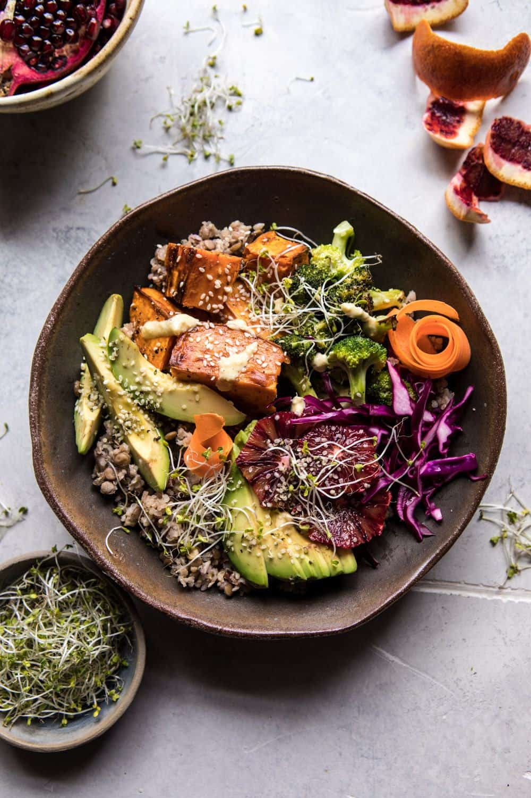

{width=100%}

**Prep Time:** 20 min | **Cook Time:** 30 min | **Total Time:** 50 min

## Ingredients

- 2 heads broccoli, cut into florets
- 1  large sweet potato, cut into wedges
- 2 tablespoons extra virgin olive oil
- kosher salt and pepper
- 2 tablespoons raw sesame seeds
- 2 cups shredded purple cabbage
- 1  juice from 1 lemon
- 1 cup cooked quinoa or brown rice
- 1 cup cooked green lentils
- 2  carrots shredded
- 1  avocado sliced
- 1  caracara or blood orange, sliced
- sprouts and hemp seeds, for serving
- ½ cup roasted cashews
- 1-2 cloves garlic, smashed
- 1 inch piece fresh ginger, peeled
- 1 tablespoon apple cider vinegar
- 1 tablespoon real maple syrup
- 1  juice from 1 lemon
- ½ teaspoon ground turmeric
- kosher salt and pepper
- 1 pinch cayenne pepper

## Instructions

1. Preheat the oven to 425 degrees F.
1. Place the sweet potato wedges on a large baking sheet and toss with 1 tablespoons olive oil, and a pinch each of salt and pepper. Transfer to the oven and cook for 15-20 minutes, then remove from the oven. Add the broccoli, the remaining tablespoon of olive oil and the sesame seeds, toss to coat. Return to the oven and roast for another 15 minutes or until the sweet potatoes are done to your likeness.
1. Meanwhile, combine the cabbage, lemon juice, and a pinch of salt in a medium bowl and massage with your hands for 30 seconds to 1 minute.
1. To assemble, toss the rice with the lentils and divide among bowls. Add the roasted veggies, cabbage, carrots, avocado, and oranges. Top with sprouts and hemp seeds and drizzle with the dressing (recipe follows).

