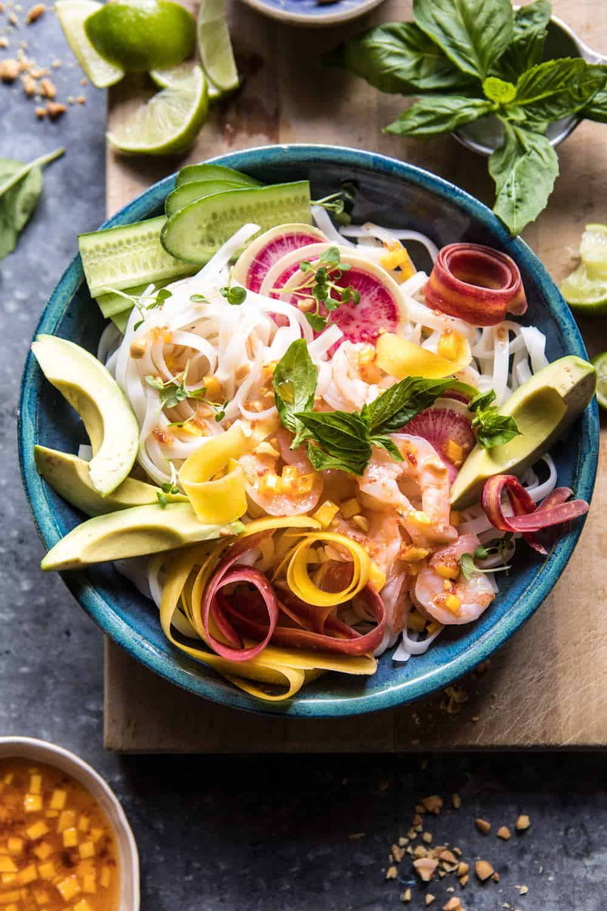

{width=100%}

**Prep Time:** 20 min | **Cook Time:** 5 min | **Total Time:** 25 min

## Ingredients

- 1/4 cup peanut or sesame oil
- 1/4 cup fresh lime juice
- 2 tablespoons rice vinegar
- 3 tablespoons honey
- 1-2 tablespoons fish sauce or low sodium soy sauce ((I use both))
- 1-2 tablespoons chili sauce  ((sambal oelek))
- 1 inch fresh ginger, grated
- 1/2  ripe mango, diced
- 8 ounces rice noodles
- 1 pound cooked shrimp
- 4  carrots, shredded
- 2  radishes, thinly sliced
- 2  Persian cucumbers, sliced
- 1  bell pepper, chopped
- 1  avocado, sliced
- 1  large handful fresh basil and cilantro
- 1  large handful fresh basil
- chopped peanuts for serving

## Instructions

1. 

