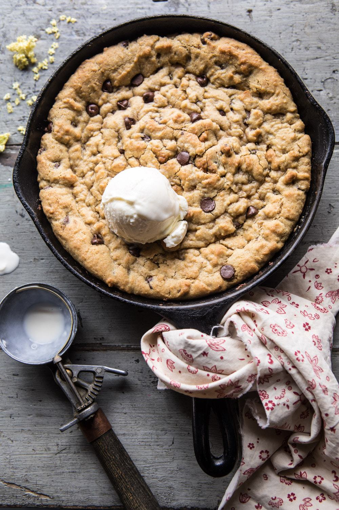

{width=100%}

**Prep Time:** 10 min | **Cook Time:** 20 min | **Total Time:** 30 min

## Ingredients

- 1 1/2 sticks (3/4 cup)  salted grass-fed butter, softened
- 2  eggs
- 3/4 cup real maple syrup
- 2 teaspoons vanilla extract
- 2 cups white whole wheat flour or whole wheat pastry flour
- 1 teaspoon baking soda
- 1 1/2 cups dark or semi-sweet chocolate chips

## Instructions

1. Preheat the oven to 350 degrees F. Grease a 10-12 inch oven safe skillet with butter.
1. In a large mixing bowl, beat the butter until light, and fluffy. Add the eggs, one at a time, until combined. Slowly add in the maple and vanilla, beating until combined. Add the flour and baking soda and beat until fully incorporated. Stir in the chocolate chips.
1. Spread the dough out in the prepared skillet. Transfer to the oven and bake for 18-20 minutes, it's OK if the center is a little gooey. Remove from the oven, let cool 3-5 minutes. DIG in, preferably with a scoop of ice cream.

