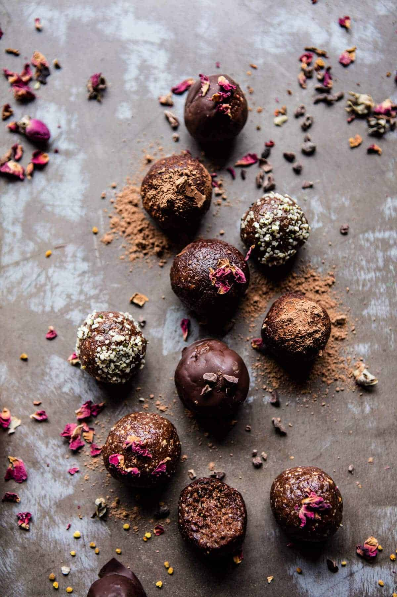

{width=100%}

**Prep Time:** 10 min | **Cook Time:**  | **Total Time:** 10 min

## Ingredients

- 25-30  medjool dates, pitted (about 2 cups packed)
- 1 1/2 cups roasted cashews
- 1/2 cup unsweetened coconut flakes
- 1/4 cup cacao powder
- 1/4 cup hemp seeds
- 2 tablespoons chia seeds
- 2 teaspoon maca powder
- 1 tablespoon orange zest
- pinch of flaky sea salt
- melted chocolate, nuts,seeds, dried roses, cocoa or cacao powder, for topping

## Instructions

1. Line a baking sheet with parchment paper.
1. Add all the ingredients to a food a processor and pulse until fully combined and the dough easily holds together when squeezed in your hand.
1. Roll the dough into tablespoon size balls. If desired, roll on your desired toppings OR dip in melted chocolate and sprinkle your toppings onto the chocolate. Allow the chocolate to set in the fridge.
1. Store the balls in an airtight container in the fridge for up to 1 week.

